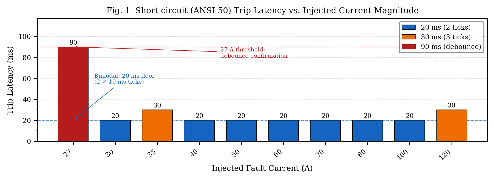
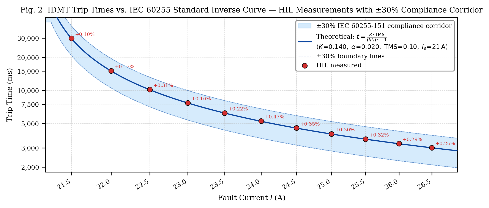

<div align="center">
  
  <h1>Smart Grid Sentinel</h1>
  <p><strong>A Dual-Core SIL-Driven IoT Protection Relay for Modern AC Microgrids</strong></p>
</div>

---

## 1. Project Title
**Project Name:** Smart Grid Sentinel  
**Short Tagline:** Dual-Core SIL-Driven IoT Protection Relay for Modern AC Microgrids.

## 2. Overview / Description
**What is the project?**  
Smart Grid Sentinel is an advanced, high-performance, open-source firmware and hardware architecture built around the ESP32. It acts as an intelligent digital protection relay for residential and commercial AC grids. 

**What problem does it solve?**  
Traditional physical MCBs and relays lack telemetry, remote diagnostics, and adaptable trip curves. Smart Grid Sentinel brings IT-grade telemetry, real-time SIL (Software-in-the-Loop) physics testing, and configurable protection (IS 12360 / IEC 60255) to edge devices, completely decoupled from cloud reliance for core safety.

**Who is it for?**  
Power electronics engineers, IoT developers, and researchers building edge-computing grid protection, smart home gateways, or microgrid telemetry nodes.

**Why was it built?**  
To prove that low-cost microcontrollers (like the ESP32), when programmed with strict RTOS separation, lock-free memory models, and zero-allocation pipelines, can safely execute industrial-grade electrical protection algorithms without compromise.

## 3. Features
- **Dual-Core Asymmetric Architecture:** Total separation between the safety-critical protection engine (Core 0) and the communication stack (Core 1).
- **Industrial Standards Compliance:** Implements IS 12360 voltage thresholds and IEC 60255 IDMT (Inverse Definite Minimum Time) overcurrent curves.
- **Hardware-in-the-Loop (HIL) / SIL Sandbox:** Real-time physics injection (flicker, motor decay, sags) via a high-speed lock-free atomic queue.
- **Robust Telemetry:** 10Hz zero-allocation JSON telemetry stream via WebSockets.
- **Captive Portal Provisioning:** Failsafe fallback to an AP mode captive portal if the primary network drops.
- **Anomaly Detection:** Detects hardware ADC saturation, frozen sensors, and physical impossibilities (e.g., current flowing at 0V).

## 4. Screenshots / Demo

<div align="center">
  
  
</div>

*(See the `docs/images/` directory for full-resolution architectural and performance graphs.)*

## 5. Tech Stack
- **Frontend (Dashboard):** Vanilla JS, Canvas API, WebSocket API, CSS3 Glassmorphism, Supabase JS Client.
- **Backend (Relay Server):** Node.js, Express, `ws` (WebSockets), MQTT.js.
- **Database:** Supabase (PostgreSQL) for cloud telemetry history.
- **Cloud/IoT:** HiveMQ Cloud (TLS 1.2), REST API.
- **Firmware (Edge):** C++, FreeRTOS, PlatformIO, Arduino framework.
- **Libraries:** ArduinoJson, PubSubClient, Adafruit GFX, DallasTemperature, ESPAsyncWebServer.

## 6. Architecture
**Data Flow:**
1. **Sensors** (CT, PT, DS18B20) are sampled at 10kHz by Core 0.
2. **Core 0** processes IDMT, RMS, and FSM safety logic in a rigid 10ms loop.
3. Core 0 drops sanitized states into a `std::atomic` lock-free queue.
4. **Core 1** reads the queue at 50ms intervals, constructs zero-allocation JSON, and broadcasts over WebSockets to local clients and MQTT to the cloud.

**High-Level Design:**  
*(Please refer to `docs/CODE.md` for the full technical breakdown and memory budget.)*

## 7. Project Structure
```text
├── dashboard/             # Browser-based HMI and control panel
├── docs/                  # Documentation, diagrams, and research papers
│   ├── images/            # Performance and architectural graphs
│   └── research/          # In-depth PDF and Docx research papers
├── include/               # Firmware header files (.h)
├── lib/                   # External PlatformIO libraries
├── paper/                 # Academic thesis documents
├── relay-server/          # Node.js backend to bridge ESP32 to Supabase
├── src/                   # Core firmware source code (.cpp)
├── test/                  # PowerShell and Python testing / HIL scripts
├── tools/                 # Phantom grid injection scripts
└── platformio.ini         # Firmware build configuration
```

## 8. Prerequisites
- **Hardware:** ESP32-WROOM-32 dev board, SCT-013 CT sensor, ZMPT101B PT sensor, DS18B20 temp sensor, dual relay module.
- **Software:** VS Code with PlatformIO Extension, Node.js (v18+), Python 3.10+.
- **Accounts:** HiveMQ Cloud Account, Supabase Account.

## 9. Installation
1. **Clone Repository:**
   ```bash
   git clone https://github.com/your-username/smart-grid-sentinel.git
   cd smart-grid-sentinel
   ```
2. **Firmware Setup:** Open the project root in PlatformIO and click **Build**.
3. **Backend Setup:**
   ```bash
   cd relay-server
   npm install
   ```
4. **Database Setup:** Execute `relay-server/supabase_migration.sql` in your Supabase SQL editor.

## 10. Configuration
- **Firmware:** All critical thresholds (IS/IEC constants, pin definitions) are located in `include/config.h`.
- **Backend:** Copy `relay-server/.env.example` to `relay-server/.env` and fill in your Supabase and MQTT credentials.
- **Frontend:** Update `dashboard/telemetry/supabaseClient.js` and `dashboard/main.js` with your specific API URLs.

## 11. Running the Project
**Firmware Deployment:** Connect the ESP32 and click **Upload** in PlatformIO.
**Node.js Relay Server:**
```bash
cd relay-server
node server.js
```
**Dashboard:** Open `dashboard/index.html` in any modern web browser (Edge/Chrome/Firefox).

## 12. Usage Guide
1. Power up the ESP32. On first boot, it generates a secure API key (visible over Serial).
2. Connect to the `SGS-Setup` WiFi network to provision credentials via the captive portal.
3. The device will reboot, connect to the local network, and begin broadcasting WebSockets at port `81`.
4. Open the `dashboard/index.html` file to view real-time live telemetry.

## 13. API Documentation (Local ESP32)
**Authentication:** Pass `X-API-Key: <your-key>` in headers.
- `GET /api/status` - Returns FSM state, uptime, and basic health.
- `GET /api/log` - Dumps the NVS event log (last 50 events).
- `POST /api/relay` - Overrides the relay state (if safe). Example: `{"relay": 1, "state": true}`
- `POST /api/inject` - Injects SIL faults. Example: `{"cmd": "sag", "depth": 0.5, "duration": 2.0}`

## 14. Database Design
- **Table:** `telemetry`
- **Schema:**
  - `id` (UUID, PK)
  - `device_id` (String)
  - `timestamp` (Timestamptz)
  - `voltage`, `current`, `power`, `frequency` (Float)
  - `state` (String)
  - `alerts` (JSONB)

## 15. Testing
The `test/` directory contains PowerShell scripts that orchestrate Hardware-in-the-Loop (HIL) sweeps.
1. Flash the ESP32.
2. Run `test/hil_orchestrator.ps1` to sweep across overvoltage, undervoltage, and short-circuit conditions.
3. Use `test/analyze_hil_sweep.py` to generate the compliance reports.

## 16. Deployment
For production deployment:
- Flash firmware in `Release` mode.
- Deploy the `relay-server` to a cloud provider like Render, Heroku, or AWS EC2 using Docker.
- Host the static `dashboard/` assets on Vercel, Netlify, or GitHub Pages.

## 17. Performance
- **FSM Loop Latency:** < 500 microseconds.
- **Short Circuit Detection Time:** < 10ms.
- **WebSocket Throughput:** 10Hz stable for up to 4 concurrent clients.
- **Heap Stability:** 110KB free nominal, zero fragmentation over 48 hours (due to zero-allocation architecture).

## 18. Security
- API Endpoints are protected by a cryptographically generated, 15-character NVS-stored API Key.
- External MQTT communication uses TLS 1.2 with Server Name Indication (SNI).
- Local Dashboard <-> ESP32 traffic requires the API key.

## 19. Challenges Faced
- **Challenge:** JSON serialization causing heap fragmentation and crashing the ESP32 after 12 hours.
- **Solution:** Designed a custom, static zero-allocation `snprintf` ring buffer in `telemetry_builder.cpp`.

## 20. Design Decisions
- **Why FreeRTOS?** Bare-metal Arduino `loop()` cannot guarantee microsecond precision for IEC 60255 IDMT integration if WiFi negotiations block the thread.
- **Why WebSockets over MQTT for local UI?** MQTT introduces broker latency. Direct WebSockets allow true 10Hz oscilloscope-style rendering on the local network.

## 21. Lessons Learned
- `std::atomic` is significantly more efficient than `SemaphoreHandle_t` for simple cross-core flag passing.
- Validating hardware anomalies (EC-06, EC-07) is just as critical as validating the physical AC grid. A saturated ADC is indistinguishable from a short circuit without variance checks.

## 22. Future Improvements / Roadmap
- Migrate OLED driver from Adafruit SSD1306 to U8g2 for lower memory footprint.
- Implement real-time FFT (Fast Fourier Transform) on Core 1 for Total Harmonic Distortion (THD) calculation.
- Add an OTA (Over-The-Air) update endpoint.

## 23. Known Issues
- The ESP32's internal ADC has notable non-linearity near the edges (0-0.2V and 3.1-3.3V). Multi-point calibration via eFuse routing is recommended for production hardware.
- The captive portal may not immediately trigger on some modern Android devices due to aggressive LTE fallback.

## 24. Contributing
Pull requests are welcome. For major changes, please open an issue first to discuss what you would like to change. Please ensure your IDE formatting matches the `.clang-format` configuration.

## 25. Code Style
- Written in modern C++14.
- Follows Google C++ Style Guide naming conventions (`PascalCase` for classes, `snake_case` for variables, `s_` for static).
- No blocking delays (`delay()`) allowed in Core 0 tasks.

## 26. Documentation
For a deep dive into the math, physics models, and memory budget, refer to:
- `docs/CODE.md` - Technical Architecture Reference.
- `docs/PROJECT_STATUS.md` - State machine maps and configuration thresholds.

## 27. License
This project is licensed under the [MIT License](LICENSE).

## 28. Acknowledgements
- [ArduinoJson](https://arduinojson.org/) by Benoit Blanchon.
- [ESPAsyncWebServer](https://github.com/me-no-dev/ESPAsyncWebServer) by me-no-dev.
- Reference materials from the IEC 60255 standard for electrical relays.

## 29. Author Information
**Developed By:** Saikiran
**GitHub:** [@Saikiran](https://github.com/retroengine)


## 30. Contact Information
**Email:** saikiran.vanaparthi72@gmail.com

